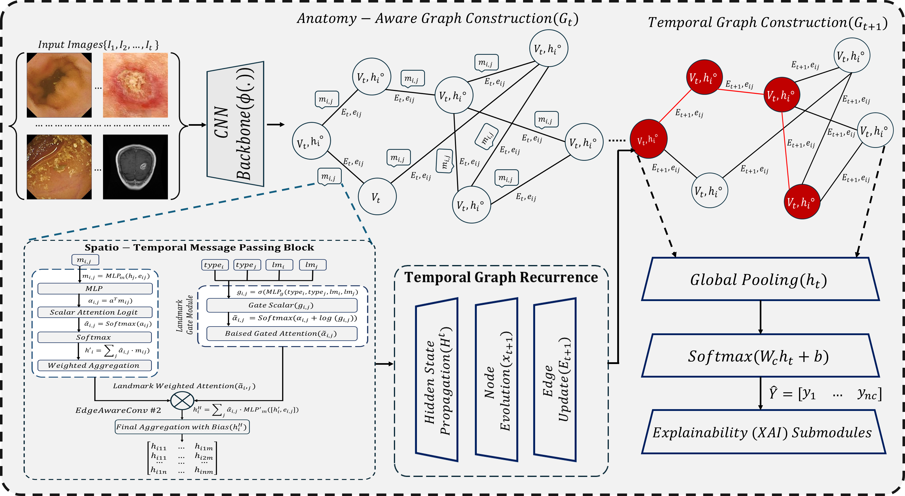

# AXGNN: Anatomy-Aware Explainable Graph Neural Networks for Human Disease Diagnosis

[](LICENSE)
[](https://www.python.org/)
[](https://pytorch-geometric.readthedocs.io/)

**AXGNN** is an anatomy-aware explainable Graph Neural Network designed for transparent and clinically aligned disease diagnosis from medical imaging data.

Deep learning models (CNNs, Vision Transformers, and standard GNNs) often overlook the hierarchical anatomical organization of the human body. This leads to predictions that lack clinical trustworthiness—especially for relational diagnostics such as lesion localization, organ interplay, and pathway prioritization (e.g., polyp detection or skin lesion malignancy).

AXGNN addresses this by constructing **adaptive hierarchical graphs** in which:
- **Nodes** encode organ substructures, tissues, and anatomical landmarks
- **Edges** capture spatial-functional and pathological dependencies
- A **landmark-gated attention** mechanism amplifies diagnostically critical regions
- A **counterfactual explanation module** answers “why not” questions and provides causal, expert-aligned insights

The framework delivers strong predictive performance **without sacrificing interpretability**, achieving high attribution fidelity while remaining suitable for real-time clinical triage.

<p align="center">
  
</p>

<p align="center"><em>Figure: Overview of the AXGNN framework. Multi-modal inputs are processed by a CNN backbone to form an Anatomy-Aware Graph. Spatio-Temporal Message Passing and Temporal Graph Recurrence capture hierarchical interactions. Landmark-gated attention and counterfactual reasoning modules provide clinically aligned explanations.</em></p>

---

## What We Set Out to Achieve

1. **Anatomy-aware modeling**  
   Explicitly encode multi-level anatomical hierarchies (organs → tissues → landmarks) into the graph structure so that the model reasons the way clinicians do.

2. **Clinically meaningful explanations**  
   Move beyond post-hoc saliency maps. Provide landmark-gated attention maps and counterfactual “why not” alternatives that align with expert reasoning and maintain high faithfulness (>95% attribution fidelity).

3. **Strong performance across domains**  
   Demonstrate that interpretability need not come at the cost of accuracy. AXGNN consistently outperforms standard GAT/GCN and strong vision baselines on endoscopy, dermatology, and related tasks.

4. **Practical deployability**  
   Design a framework that supports real-time triage, AR-assisted surgery workflows, and equitable global diagnostics while remaining robust to noisy clinical scans.

---

## Repository Structure

```
axgnn/
├── Model/                          # Core model implementation
│   ├── GNN_model.py                # Full AXGNN architecture, training loop, XAI utilities
│   └── About model.docx            # Additional model documentation
│
├── Dataset Specific RUN/           # Per-dataset experiments and outputs
│   ├── GastroEndoNet Dataset/
│   ├── Kvasir-capsule dataset/
│   ├── ISIC dataset/
│   ├── ISIC premisive dataset/
│   ├── Malaria/
│   ├── TCGA Liver Cancer (LIHC) Clinical Dataset/
│   └── Note.md
│
├── rsc/                            # Resources & figures
│   ├── mtd.png                     # Method diagram (shown above)
│   └── not.md
│
├── rsc.note.md
└── README.md                       # You are here
```

### Key Components

| Component | Description |
|-----------|-------------|
| **Graph Construction** | Converts raw medical images + metadata into heterogeneous graphs guided by anatomical ontologies |
| **Landmark Gate** | Binary + learned gating that prioritizes lesion/polyp/organ nodes during message passing |
| **Edge-Aware Attention** | Type-aware message construction + attention modulated by the landmark gate |
| **Counterfactual Module** | Gradient × Input saliency + minimal feature perturbation to produce “why not” explanations and faithfulness curves |
| **Training** | Weighted cross-entropy (log-damped) + AdamW + cosine annealing with early stopping on AUROC |

---

## Datasets Evaluated

AXGNN was benchmarked on six diverse medical imaging collections spanning endoscopy, dermatology, and microscopy:

- **Kvasir-Capsule** – Video capsule endoscopy (polyps, angiectasia, etc.)
- **GastroEndoNet** – High-resolution endoscopy (GERD / Polyp classification)
- **ISIC & ISIC Permissive** – Dermoscopic skin lesion classification
- **SLICE-3D** – 3D total-body photography lesion crops
- **Malaria Bounding Box (MBB)** – Thin blood smear parasite detection

Results highlight strong generalization on 2D endoscopic and dermatological tasks (F1 frequently >99%) while identifying opportunities for future 3D adaptations.

---

## Quick Start (High-Level)

1. Prepare graphs for a target dataset (see dataset-specific folders for examples).
2. Configure paths and hyperparameters in `Model/GNN_model.py`.
3. Run training:
   ```bash
   python Model/GNN_model.py
   ```
4. Inspect outputs: training curves, confusion matrices, attention heatmaps, and counterfactual faithfulness plots are saved automatically under the configured `OUT_DIR`.

Detailed per-dataset run instructions and pre-computed results live inside `Dataset Specific RUN/`.

---

## Key Results (Selected)

| Dataset          | Accuracy | F1-Score | AUPRC |
|------------------|----------|----------|-------|
| GastroEndoNet    | 99.43%   | 99.44%   | 0.99  |
| Kvasir-Capsule   | 98.83%   | 99.84%   | 0.99  |
| ISIC             | 99.98%   | 99.95%   | 0.99  |
| ISIC Permissive  | 99.37%   | 99.35%   | 0.99  |

Ablation studies confirm that landmark gating, edge-type embeddings, and dual-layer edge-aware convolutions each contribute meaningfully to both accuracy and interpretability.

**Paper**: [Anatomy-Aware Explainable Graph Neural Networks for Human Disease Diagnosis](https://openreview.net/forum?id=vGbxDj1ti1) (ICML 2026)
---

## Citation

If you use this work, please cite the corresponding paper:

```bibtex
@inproceedings{axgnn2025,
  title     = {Anatomy-Aware Explainable Graph Neural Networks for Human Disease Diagnosis},
  author    = {Anonymous},
  booktitle = {CVPR},
  year      = {2025}
}
```

---

## License

This project is released under the MIT License. See [LICENSE](LICENSE) for details.

---

**Bridging the gap between high-performance graph reasoning and clinically trustworthy explanations.**  
Questions or contributions are welcome — feel free to open an issue or pull request.
